# 📘 EININIDII - Instalação/Configuração do SCADA‑LTS
> **Professor**: Josué Morais  
> **Disciplina**: Instrumentação Industrial II  
> **Curso**: Engenharia de Controle e Automação  
> **Instituição**: Universidade Federal de Uberlândia — FEELT  

<details>
  <summary><strong>📑 Índice </strong></summary>

- [🎯 Objetivo](#objetivo)
- [🤝 Colaboradores](#colaboradores)
- [🧰 Pré-requisitos](#pre-requisitos)
  - [Software](#software)
  - [Hardware](#hardware)

- [☕ Instalação do OpenJDK](#instalacao-openjdk)
- [🖥️ Instalação do SCADA‑LTS](#instalacao-scadalts)
- [🌐 Acesso ao SCADA‑LTS (Service Manager)](#acesso-scadalts)
- [📡 MODBUS Server — CODESYS](#modbus-server)
- [🔁 MODBUS Client — SCADA‑LTS](#modbus-client)
- [⚠️ Observações finais](#observacoes)

</details>

---

<a id="objetivo"></a>
<details open>
  <summary><strong>🎯 Objetivo</strong></summary>

Este tutorial tem como objetivo orientar, de forma **didática e passo a passo**, a **instalação e configuração do SCADA‑LTS**, integrando-o a um **servidor Modbus configurado no CODESYS**, permitindo leitura e escrita de dados industriais via **Modbus TCP**.

Ao final deste procedimento, o sistema estará:
- ✅ SCADA‑LTS instalado e operacional
- ✅ Comunicação Modbus funcional
- ✅ Integração entre CODESYS e SCADA‑LTS validada

</details>

---

<a id="colaboradores"></a>
<details>
  <summary><strong>🤝 Colaboradores</strong></summary>

Este projeto é resultado de um esforço conjunto. A participação das pessoas abaixo foi essencial:

- **Amanda Caetano Alvarenga**
- **Gabriel Zuccolotto Alecrim**
- **Luan Rafael Pereira Santos**

A cada um(a), nosso agradecimento pelo compromisso, pela parceria e pela qualidade do trabalho entregue.

</details>

---

<a id="pre-requisitos"></a>
<details>
  <summary><strong>🧰 Pré-requisitos</strong></summary>

<a id="software"></a>
### Software
- ✅ Windows 10 ou 11
- ✅ OpenJDK (Microsoft Build)
- ✅ SCADA‑LTS (Windows Installer)
- ✅ CODESYS V3.5 (para o servidor Modbus)

<a id="hardware"></a>
### Hardware
- ✅ Computador com acesso à rede
- ⚠️ PLC virtual (CODESYS Control Win) ou PLC físico/soft-PLC equivalente

</details>

---

<a id="instalacao-openjdk"></a>
<details>
  <summary><strong>☕ Instalação do OpenJDK</strong></summary>

Para realizar a instalação do OpenJDK, utilize o link oficial (Microsoft Build of OpenJDK):  
🔗 **Download:** https://learn.microsoft.com/en-us/java/openjdk/download

O **OpenJDK (Java Development Kit)** fornece compilador, JVM e bibliotecas padrão para desenvolvimento/execução de aplicações Java.

<a id="openjdk-passo-1"></a>
### 🔹 Passo 1 – Baixar e executar o instalador


1. Acesse o link de download
2. Baixe o instalador do OpenJDK
3. Execute o arquivo baixado

---

<a id="openjdk-passo-2"></a>
### 🔹 Passo 2 – Aceitar os termos de licença


1. Leia os termos de licença
2. Marque/aceite os termos
3. Clique em **Next** para continuar

---

<a id="openjdk-passo-2"></a>
### 🔹 Passo 2b – Instalar para todo so Usuarios

1. Deixe no padrão que é instalar para todos os usuarios.
2. Clique em **Next** para continuar

---

<a id="openjdk-passo-3"></a>
### 🔹 Passo 3 – Configurar “JAVA_HOME”


1. Na tela de customização, **marque** a opção **Set JAVA_HOME variable**
2. Clique em **Next**

---

<a id="openjdk-passo-4"></a>
### 🔹 Passo 4 – Iniciar a instalação


1. Clique em **Install**
2. Aguarde a instalação finalizar

---

<a id="openjdk-passo-5"></a>
### 🔹 Passo 5 – Abrir variáveis de ambiente


1. Abra as **Configurações do Windows**
2. Pesquise por **Variáveis de ambiente**
3. Abra a tela de edição das variáveis

---

<a id="openjdk-passo-6"></a>
### 🔹 Passo 6 – Editar o Path


1. Em **Variáveis do sistema**, selecione **Path**
2. Clique em **Editar**

---

<a id="openjdk-passo-7"></a>
### 🔹 Passo 7 – Adicionar o diretório do JDK ao Path


1. Clique em **Novo**
2. Adicione o caminho do JDK (pasta **bin**) que normalmente é:
```bat
C:\Program Files\Microsoft\jdk-25.0.2.10-hotspot\bin
```
3. Confirme em **OK**

---

<a id="openjdk-passo-8"></a>
### 🔹 Passo 8 – Conferir/confirmar JAVA_HOME


1. Verifique se a variável **JAVA_HOME** foi criada corretamente 
2. Confirme o caminho apontando para a pasta do JDK: 
```bat
C:\Program Files\Microsoft\jdk-25.0.2.10-hotspot
```

---

<a id="openjdk-passo-9"></a>
### 🔹 Passo 9 – Validar no Prompt de Comando


1. Abra o Prompt (CMD)
2. Execute:
```bat
java -version
```
3. Confirme se a versão do Java aparece corretamente

</details>

---

<a id="instalacao-scadalts"></a>
<details>
  <summary><strong>🖥️ Instalação do SCADA‑LTS</strong></summary>

Baixe o instalador:
🔗 https://github.com/SCADA-LTS/windows-installer/releases

<a id="scada-passo-1"></a>
### 🔹 Passo 1 – Aviso de segurança do Windows


1. Ao executar o instalador, o Windows pode exibir aviso
2. Clique em **Mais informações**

---

<a id="scada-passo-2"></a>
### 🔹 Passo 2 – Executar assim mesmo


1. Clique em **Executar assim mesmo**

---

<a id="scada-passo-3"></a>
### 🔹 Passo 3 – Selecionar idioma (início)


1. Inicie o instalador
2. Selecione o idioma quando solicitado

---

<a id="scada-passo-4"></a>
### 🔹 Passo 4 – Selecionar idioma (confirmar)


1. Confirme o idioma selecionado
2. Clique em **OK/Avançar**

---

<a id="scada-passo-5"></a>
### 🔹 Passo 5 – Tela do assistente


1. Avance no assistente de instalação

---

<a id="scada-passo-6"></a>
### 🔹 Passo 6 – Aceitar o contrato de licença


1. Leia o contrato
2. Aceite os termos
3. Clique em **Next**

---

<a id="scada-passo-7"></a>
### 🔹 Passo 7 – Escolher diretório de instalação


1. Escolha o diretório (ou mantenha o padrão)
2. Clique em **Next**

---

<a id="scada-passo-8"></a>
### 🔹 Passo 8 – Opções padrão (tela 1)


1. Mantenha as opções padrão, se aplicável
2. Clique em **Next**

---

<a id="scada-passo-9"></a>
### 🔹 Passo 9 – Opções padrão (tela 2)


1. Continue avançando com as opções padrão

---

<a id="scada-passo-10"></a>
### 🔹 Passo 10 – Configurar porta, usuário e senha


1. Defina a porta HTTP (ex.: **8080**)
2. Crie/defina usuário e senha de administrador

---

<a id="scada-passo-11"></a>
### 🔹 Passo 11 – Instalar servidor local (obrigatório)


1. **Marque a opção de instalar servidor local**
2. Avance para continuar

---

<a id="scada-passo-12"></a>
### 🔹 Passo 12 – Finalização (tela 1)


1. Aguarde a instalação concluir
2. Avance/Finalize quando disponível

---

<a id="scada-passo-13"></a>
### 🔹 Passo 13 – Finalização (tela 2)


1. Clique em **Finish**
2. O SCADA‑LTS estará instalado

</details>

---

<a id="acesso-scadalts"></a>
<details>
  <summary><strong>🌐 Acesso ao SCADA‑LTS (Service Manager)</strong></summary>

<a id="acesso-passo-1"></a>
### 🔹 Passo 1 – Acessar pelo navegador


1. Abra o navegador e acesse:
```
http://localhost:8080/Scada-LTS/
```
2. Caso não carregue, abra o **Scada‑LTS Service Manager**
3. Defina **Startup Type = Automatic**
4. Clique em **Start**
5. Clique em **OK**

</details>

---

<details>
  <summary><strong>📡 4. MODBUS Server — CODESYS</strong></summary>

Neste capítulo será realizada a configuração do **CODESYS como Servidor Modbus TCP**, incluindo criação do projeto, inserção do servidor Modbus, configuração de comunicação, mapeamento de variáveis e inicialização do PLC.

---

### 🔹 Passo 1 – Criar o servidor Modbus no projeto
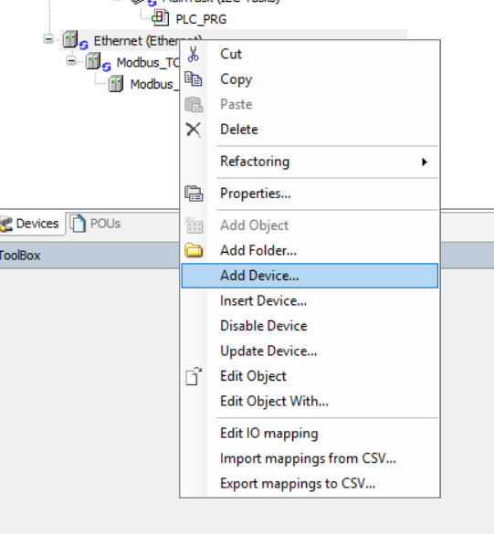

1. Na árvore de dispositivos do CODESYS, clique com o botão direito sobre **Ethernet**.
2. Selecione **Add Device…** para adicionar um novo dispositivo à rede.

---

### 🔹 Passo 2 – Selecionar o Modbus TCP Server
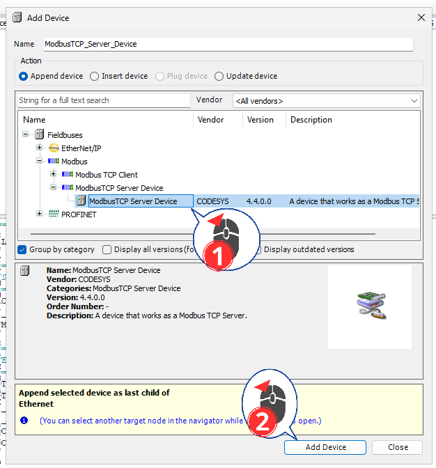

1. Na lista de dispositivos disponíveis, localize **Modbus TCP Server**.
2. Selecione o dispositivo.
3. Clique em **Add Device** para inseri-lo no projeto.

---

### 🔹 Passo 3 – Acessar os parâmetros do Modbus TCP Server
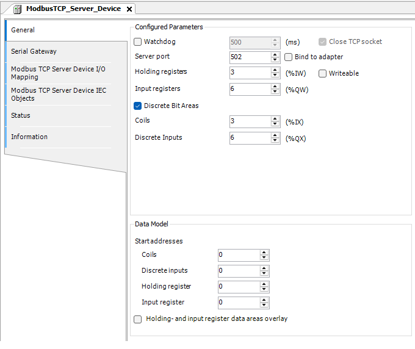

1. Selecione o **ModbusTCP_Server_Device**.
2. Acesse a aba de **parâmetros configurados**.
3. Observe os campos relacionados a registradores e áreas de dados.

---

### 🔹 Passo 4 – Abrir o mapeamento de variáveis do servidor
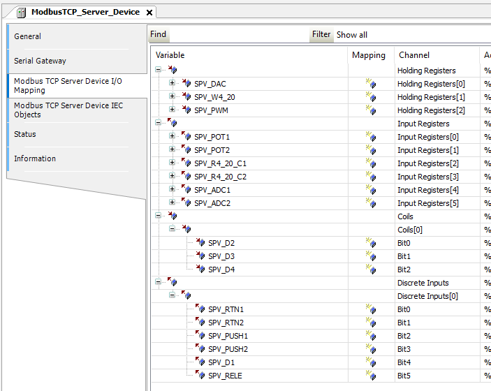

1. Clique na opção **ModbusTCPServer I/O Mapping**.
2. Esta tela será usada para associar variáveis do PLC aos registradores Modbus.
3. Abaixo vc pode copiar estas variavies e colar no seu devido lugar.

```ST
// ================================
// HOLDING REGISTERS (setpoints do SCADA)
// ================================
SPV_DAC
SPV_W4_20
SPV_PWM

// ================================
// INPUT REGISTERS (somente leitura no SCADA)
// ================================
SPV_POT1
SPV_POT2
SPV_R4_20_C1
SPV_R4_20_C2
SPV_ADC1
SPV_ADC2

// ================================
// COILS (comandos digitais do SCADA)
// ================================
SPV_D2
SPV_D3
SPV_D4

// ================================
// DISCRETE INPUTS (somente leitura no SCADA)
// ================================
SPV_RTN1
SPV_RTN2
SPV_PUSH1
SPV_PUSH2
SPV_D1
SPV_RELE
```

---

### 🔹 Passo 5 – Criar um novo POU (programa)


1. Clique com o botão direito sobre **Application**.
2. Selecione **Add Object**.
3. Escolha a opção **POU** para criar um programa.

---

### 🔹 Passo 6 – Configurar o POU
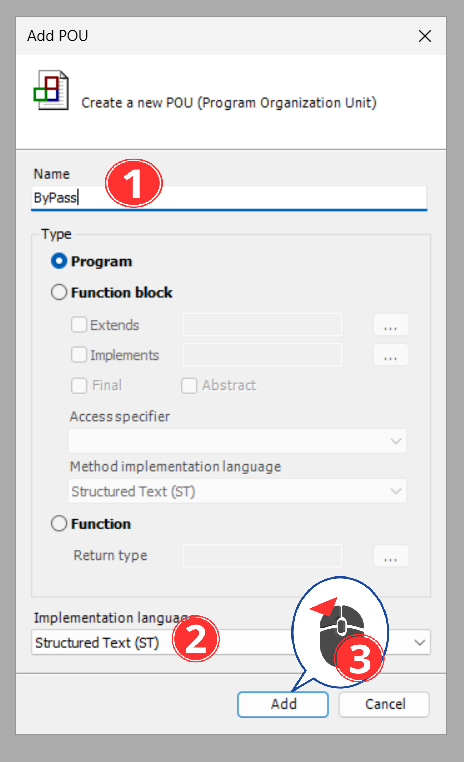

1. Defina o nome do POU.
2. Selecione o tipo **Program**.
3. Escolha a linguagem **Structured Text (ST)**.
4. Clique em **Add**.

---

### 🔹 Passo 7 – Programar as variáveis do PLC
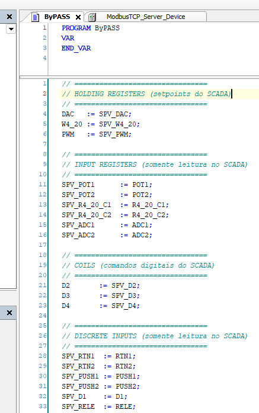

1. Insira o código do programa no editor ST.
2. Defina variáveis que serão utilizadas no mapeamento Modbus.
3. Salve o programa.

```ST
// ================================
// HOLDING REGISTERS (setpoints do SCADA)
// ================================
DAC   := SPV_DAC;
W4_20 := SPV_W4_20;
PWM   := SPV_PWM;

// ================================
// INPUT REGISTERS (somente leitura no SCADA)
// ================================
SPV_POT1      := POT1;
SPV_POT2      := POT2;
SPV_R4_20_C1  := R4_20_C1;
SPV_R4_20_C2  := R4_20_C2;
SPV_ADC1      := ADC1;
SPV_ADC2      := ADC2;

// ================================
// COILS (comandos digitais do SCADA)
// ================================
D2       := SPV_D2;
D3       := SPV_D3;
D4       := SPV_D4;

// ================================
// DISCRETE INPUTS (somente leitura no SCADA)
// ================================
SPV_RTN1  := RTN1;
SPV_RTN2  := RTN2;
SPV_PUSH1 := PUSH1;
SPV_PUSH2 := PUSH2;
SPV_D1    := D1;
SPV_RELE  := RELE;
```

---

### 🔹 Passo 8 – Configurar comunicação do dispositivo
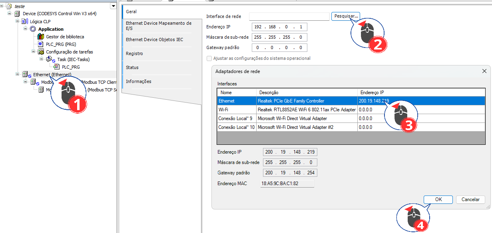

1. Acesse as **Communication Settings** do dispositivo.
2. Clique em **Scan Network**.
3. Selecione o controlador encontrado.
4. Confirme em **OK**.

---

### 🔹 Passo 9 – Iniciar o CODESYS Control Win
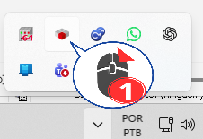

1. Na barra de ícones do Windows, localize o **CODESYS Control Win**.
2. Dê duplo clique para iniciar o controlador virtual.

---

### 🔹 Passo 10 – Abrir o CODESYS Control Win
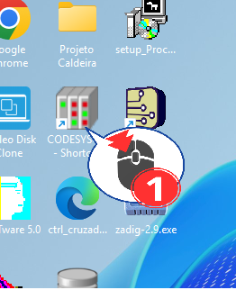

1. Localize o atalho do **CODESYS Control Win** na área de trabalho.
2. Execute o controlador para permitir o login do PLC.

---

### 🔹 Passo 11 – Verificar a estrutura do projeto


1. Confira se **Application**, **Ethernet** e **Modbus TCP Server** aparecem corretamente.
2. Esta estrutura indica que o projeto está pronto para comunicação.

---

### 🔹 Passo 12 – Acessar as configurações de comunicação
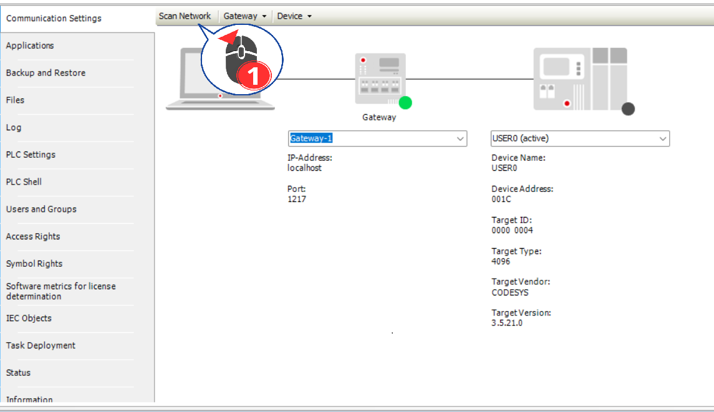

1. Abra a tela de **Communication Settings**.
2. Confirme o controlador selecionado e o status da conexão.

---

### 🔹 Passo 13 – Selecionar o controlador encontrado na rede
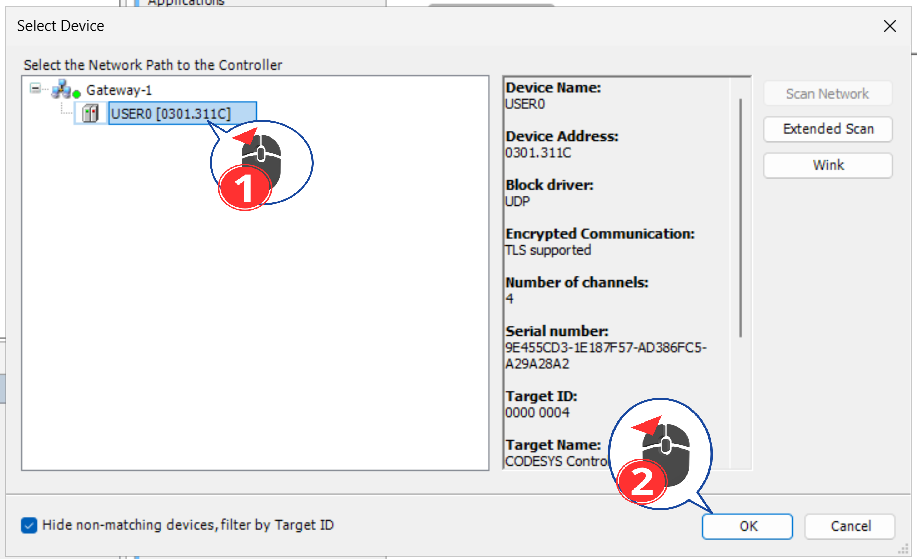

1. Selecione o dispositivo encontrado no scan.
2. Confirme a escolha clicando em **OK**.

---

### 🔹 Passo 14 – Configurar parâmetros do Modbus TCP Server
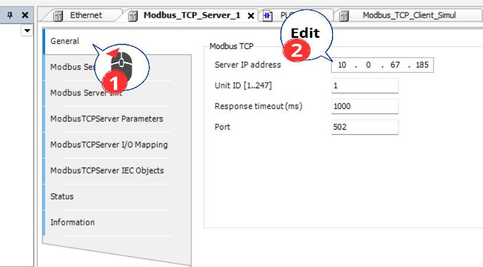

1. Acesse a aba **General** do Modbus TCP Server.
2. Configure:
   - **Unit-ID**
   - **Porta Modbus (502)**
3. Confirme os valores conforme a rede do laboratório.

---

### 🔹 Passo 15 – Realizar login no PLC
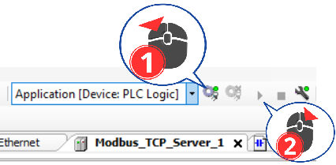

1. Clique em **Login**.
2. Em seguida, clique em **Run** para iniciar o PLC.

---

### 🔹 Passo 16 – Criar usuário do dispositivo
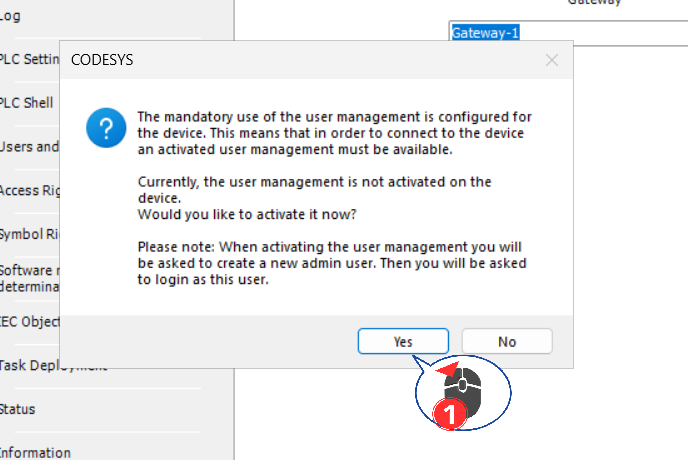

1. Ao ser solicitado, escolha **Yes** para ativar o gerenciamento de usuários.
2. Esta etapa é obrigatória para execução do PLC.

---

### 🔹 Passo 17 – Definir credenciais do usuário
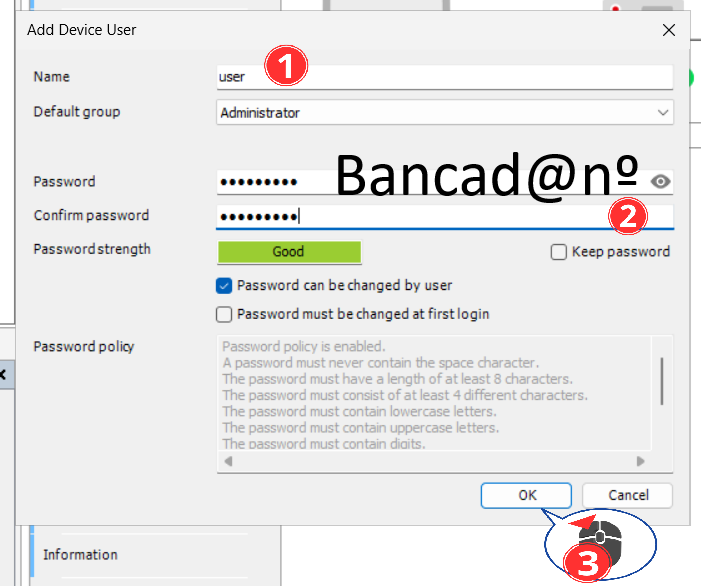

1. Crie um usuário (ex.: `user`).
2. Defina a senha conforme a política apresentada.
3. Clique em **OK** para finalizar.

---

Ao final desses passos, o **CODESYS estará operando como Servidor Modbus TCP**, pronto para comunicação com o **SCADA-LTS**.

</details>

---

<a id="modbus-client"></a>
<details>
  <summary><strong>🔁 MODBUS Client — SCADA‑LTS</strong></summary>

Aqui você irá configurar o SCADA‑LTS para **conectar no servidor Modbus (CODESYS)** e criar os **Data Points**.

<a id="scada-client-passo-1"></a>
### 🔹 Passo 1 – Abrir Data Sources


1. No SCADA‑LTS, vá em **Ferramentas → Data Sources**
2. Clique para adicionar uma nova fonte de dados

---

<a id="scada-client-passo-2"></a>
### 🔹 Passo 2 – Selecionar “Modbus IP”


1. No tipo de Data Source, selecione **Modbus IP**
2. Confirme para criar a fonte

---

<a id="scada-client-passo-3"></a>
### 🔹 Passo 3 – Configurar Host e Porta


1. Em **Host**, coloque o IP do servidor (ex.: `localhost` ou IP do PC/PLC)
2. Em **Port**, coloque a porta Modbus (padrão **502**)
3. Salve a configuração

---

<a id="scada-client-passo-4"></a>
### 🔹 Passo 4 – Criar Data Point (tela 1)


1. Dentro do Data Source criado, clique em **Add Data Point**
2. Defina nome e tipo do ponto (conforme o registrador)

---

<a id="scada-client-passo-5"></a>
### 🔹 Passo 5 – Criar Data Point (tela 2)


1. Configure endereço, função e demais parâmetros
2. Salve o Data Point

---

<a id="scada-client-passo-6"></a>
### 🔹 Passo 6 – Validar Data Points (tela final)


1. Confirme os Data Points criados
2. Verifique status de conexão e leitura/escrita

</details>

---

<a id="observacoes"></a>
<details>
  <summary><strong>⚠️ Observações finais</strong></summary>

- Verifique portas **8080** (SCADA‑LTS) e **502** (Modbus)
- Confirme PLC em **RUN**
- Ajuste firewall do Windows se necessário
- Se não conectar via rede, teste primeiro com **localhost** (quando SCADA e CODESYS estão no mesmo PC)

</details>
