# 📘 EININIDII - Instalação/Configuração do SCADA‑LTS
> **Professor**: Josué Morais  
> **Disciplina**: Instrumentação Industrial II  
> **Curso**: Engenharia de Controle e Automação  
> **Instituição**: Universidade Federal de Uberlândia — FEELT  

---

## Colaboradores

Este projeto é resultado de um esforço conjunto. A participação das pessoas abaixo foi essencial:

- **Amanda Caetano Alvarenga**
- **Gabriel Zuccolotto Alecrim**
- **Luan Rafael Pereira Santos**

A cada um(a), nosso agradecimento pelo compromisso, pela parceria e pela qualidade do trabalho entregue.

---

## 📑 Índice
- [1. Instalação do OpenJDK](#1-instalação-do-openjdk)
- [2. Instalação do SCADA‑LTS](#2-instalação-do-scada-lts)
- [3. Acesso ao SCADA‑LTS (Service Manager)](#3-acesso-ao-scada-lts-service-manager)
- [4. MODBUS Server — CODESYS](#4-modbus-server--codesys)
- [5. MODBUS Client — SCADA‑LTS](#5-modbus-client--scada-lts)

---

## 1. Instalação do OpenJDK

Para realizar a instalação do OpenJDK, utilize o link oficial (Microsoft Build of OpenJDK):  
🔗 **Download:** https://aka.ms/download-jdk/microsoft

O **OpenJDK (Java Development Kit)** fornece compilador, JVM e bibliotecas padrão para desenvolvimento/execução de aplicações Java — base usada amplamente em academia e indústria.

1. **Baixe e execute** o instalador do OpenJDK. 

   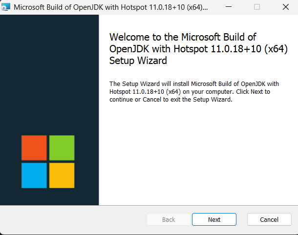

2. **Aceite os termos de licença.**  

   

3. Na tela de customização, ative **“Set JAVA_HOME variable”** → *Will be installed on local hard drive* → **Next** → **Install**.  

   

4. Ao clicar next, uma nova tela se abrirá e click **Install**, é possivel que vc tenha que aceitar rodar como Administrator.  

   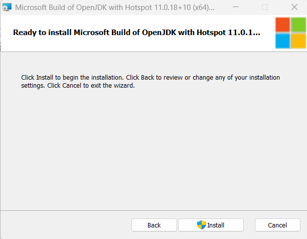

5. Ao finalizar, **edite o PATH/JAVA_HOME**:

      1. Clique no **Iniciar** e digite: **variáveis de ambiente**.
      2. Abra **“Editar as variáveis de ambiente do sistema”**.
      3. Na janela **Propriedades do Sistema**, aba **Avançado**, clique em **Variáveis de Ambiente…**.

   

6. Em **Variáveis do Sistema** → selecione **Path** → **Editar**.  

   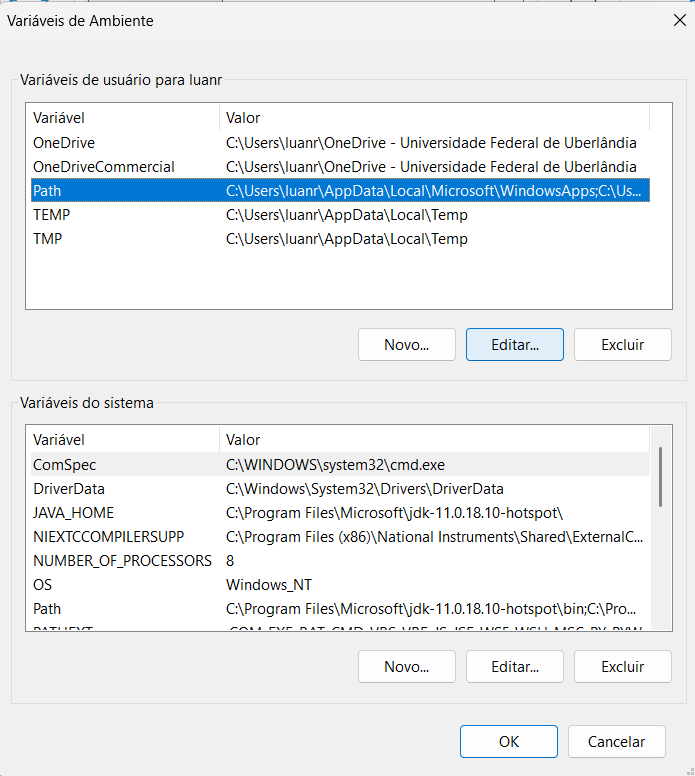

7. Encontre a pasta de instalação do OpenJDK (ex.:  
   `C:\Program Files\Microsoft\jdk-11.0.18.10-hotspot` ou `C:\Program Files\Java\...`).  
   Clique em **Novo** → **cole o caminho completo da pasta do JDK** (inclua a pasta com o nome do JDK).  

   

8. Confirme que **JAVA_HOME** aponta para a pasta do JDK e salve (**OK** nas janelas).
 
   

9. Valide a instalação no **Prompt de Comando**:
   ```bat
   java -version
   ```
   A saída deve exibir a versão do Java instalada.  
   

---

## 2. Instalação do SCADA‑LTS

Baixe o instalador **.exe** do SCADA‑LTS:  
🔗 **Releases Windows:** https://github.com/SCADA-LTS/windows-installer/releases  
> O roteiro utilizou a versão **v2.1.0**, mas versões mais novas podem ser usadas.

1. Após o download, o Windows pode exibir aviso de segurança. Selecione **“Mais informações”** → **“Executar assim mesmo”**.  
   

> 💡 **Importante:** O instalador pode ser marcado como ameaça pelo **antivírus**, mesmo sem risco real. Após o download, abra o arquivo e, se a tela de segurança aparecer, clique em **Mais informações**.

   

> Em seguida basta clicar em **Executar assim mesmo**.
   
   

2. Selecione o **idioma**.  

   

3. **Avançar** no assistente.  

   

4. **Aceite** o **Acordo de Licença**.  

   

5. Escolha/aceite o **Local de Destino** → **Avançar**.  

   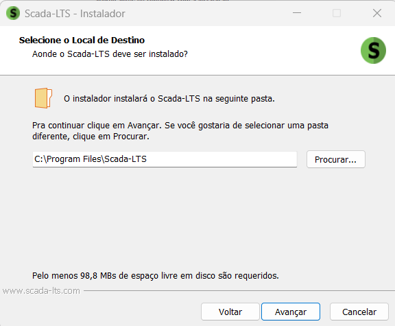

6. **Avance** nas telas seguintes com as opções padrão.  

   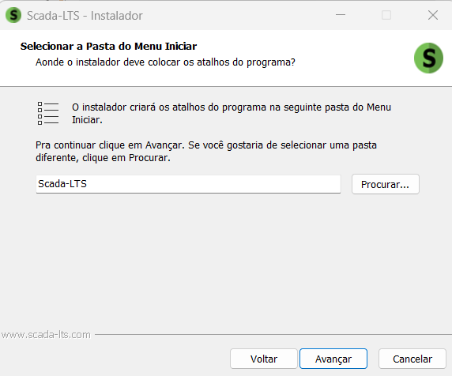  
   

7. Configure a **Porta HTTP** (padrão **8080**; escolha outra se já estiver em uso), **Nome de Usuário** e **Senha**.  

   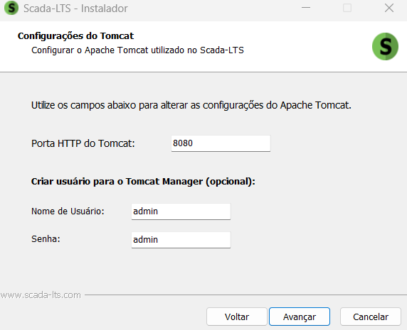

8. Marque **“Instalar servidor local”** → **Avançar** → **Instalar**.  

   > **ALERTA:** Este passo é VITAL, se você esquecer do mesmo terá que instalar novamente.

   

   

9. **Concluir** para finalizar.  

   

---

## 3. Acesso ao SCADA‑LTS (Service Manager)

Abra no navegador:
```
http://localhost:8080/Scada-LTS/
```
> Se alterou a porta HTTP, substitua `8080` pela porta escolhida.

Caso não abra, use o **Scada‑LTS Service Manager**: defina **Startup Type = Automatic**, clique **Start** e **OK**. 


---

## 4. MODBUS Server — CODESYS

Nesta etapa, o **CODESYS** será configurado como **servidor Modbus TCP**, que enviará dados de processo para o supervisório.

1. **Crie um projeto**: `Novo projeto`.  

   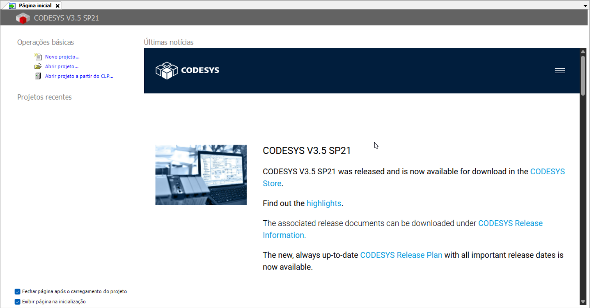

2. **Nome e diretório** → **OK**.  

   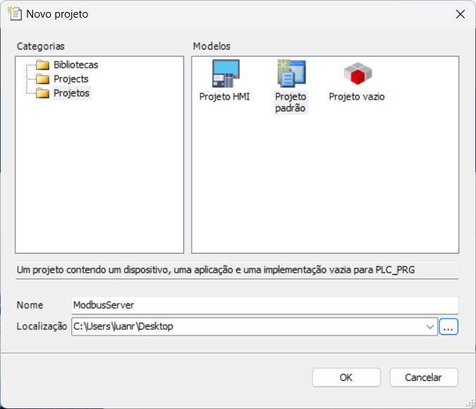

3. Selecione o dispositivo **CODESYS Control Win V3 x64** (CLP virtual) e a linguagem (recomenda‑se **LD** ou **ST** para `PLC_PRG`). **OK**.  

   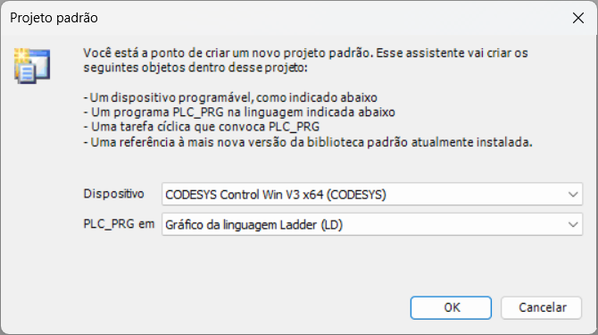

4. Na árvore do projeto, clique direito em **Device (CODESYS Control Win V3 x64)** → **Adicionar dispositivo...**  

   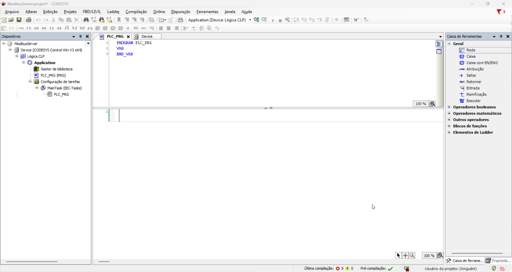

5. Em **Adicionar dispositivo**: **Barramentos de campo** → **Adaptador Ethernet** → **Ethernet** → **Adicionar dispositivo**.  

   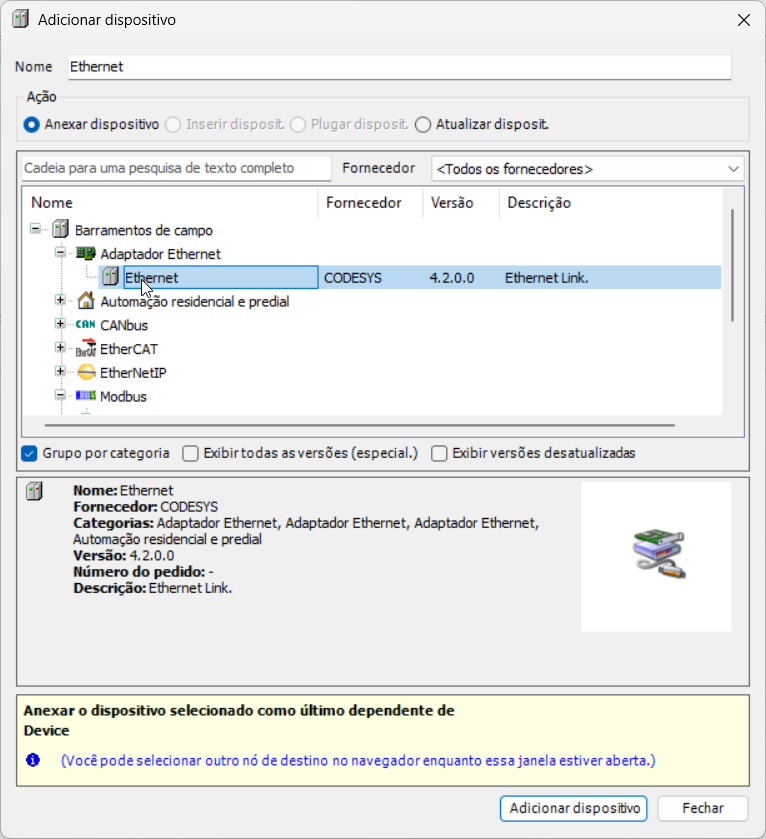

6. Ainda em **Adicionar dispositivo**, selecione **Ethernet** (adicionado) → **Modbus** → **ModbusTCP Server Device** → **Adicionar dispositivo**.  

   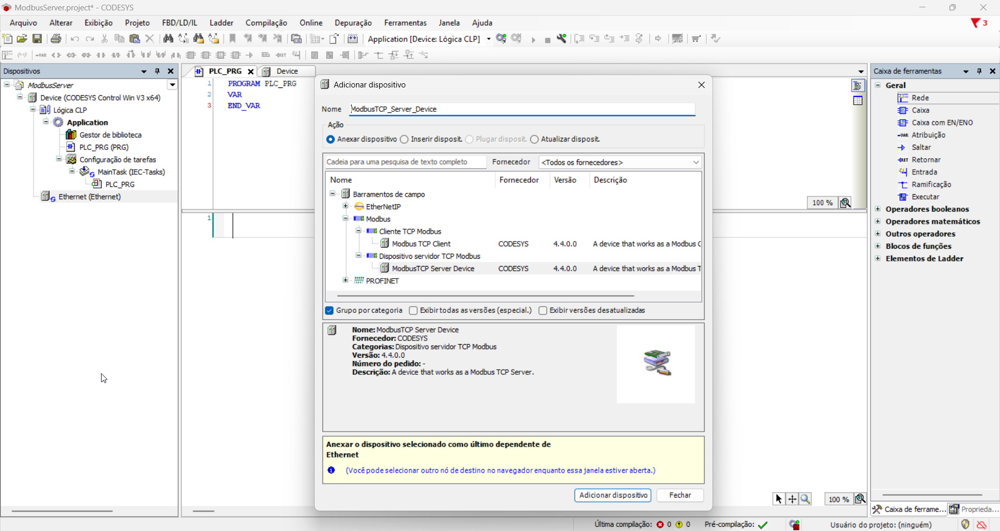

7. Confirme que **Ethernet** e **ModbusTCP Server** aparecem na árvore.  

   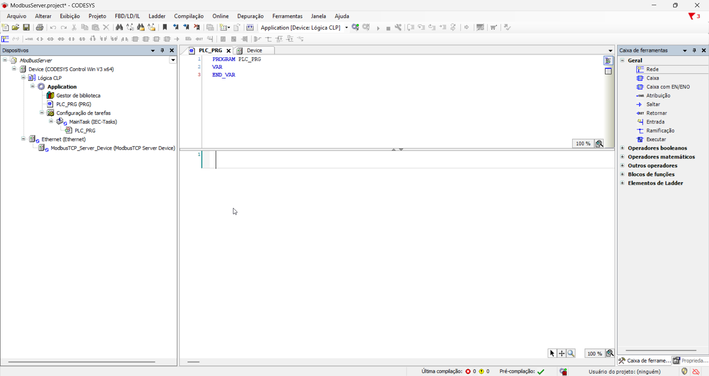

8. **Ligue o CLP** (CODESYS Control Win x64): na *system tray* do Windows, **CODESYS Gateway Systray – x64**, clique direito → **Start PLC**. Depois, em **Device**, clique **Escanear rede**.  
     
   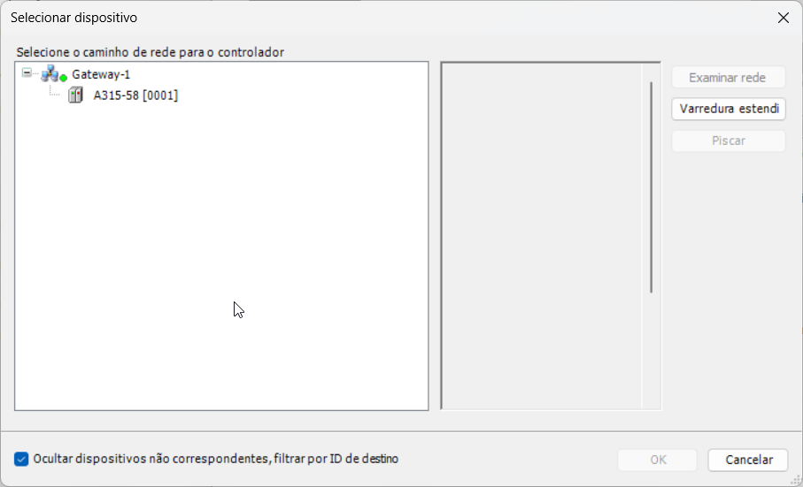

9. Na **primeira vez**, crie **usuário/senha** do CLP (depois reaproveite o login).  
   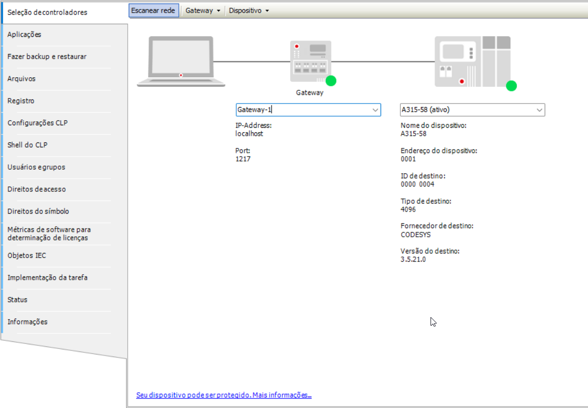

10. Configure o **Adaptador Ethernet**: em **Ethernet (Ethernet)** → **Geral** → **Interface de rede** → **Pesquisar...** → selecione a interface **Wi‑Fi** → **OK**.  
    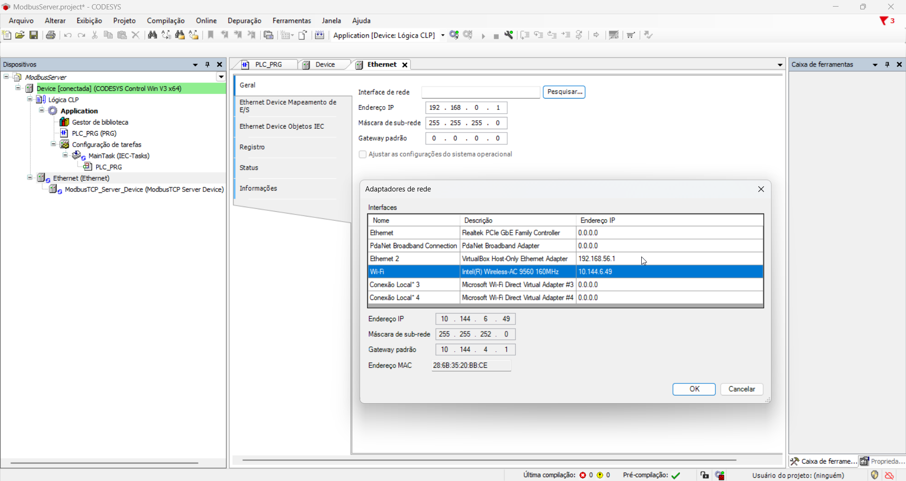

11. Configure o **Servidor Modbus**: **Porta = 502**.  
    - **Holding Registers** (Registros de retenção) e **Input Registers** (Registros de entrada): informe **quantidade de registros** (palavras de 16 bits) conforme a necessidade (padrão 10 cada, se suficiente).  
    - **Coils** e **Input Status** (variáveis discretas): informe a **quantidade de bits** (ex.: 8 → 1 byte).  
    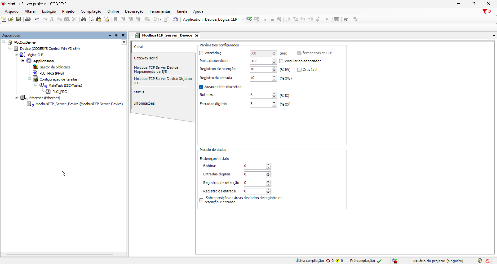

12. Em **Modbus TCP Server Device — Mapeamento de E/S** (*não* defina nomes nas variáveis automaticamente, para poder mapear bits/bytes):  
    - Entradas (Holding Registers):  
      `Entradas[0] = DP_MV_FIC100A`, `Entradas[1] = DP_SP_FIC100A`  
    - Saídas (Input Register):  
      `Saídas[0] = DP_PV_FIC100A`  
    - Bobinas (Coils):  
      `Bobinas[0] = DP_AM_FIC100A`, `Bobinas[1] = DP_LR_FIC100A`  
    - Habilite **Sempre atualizar variáveis / Utilizar tarefa do ciclo de barramento...**  
    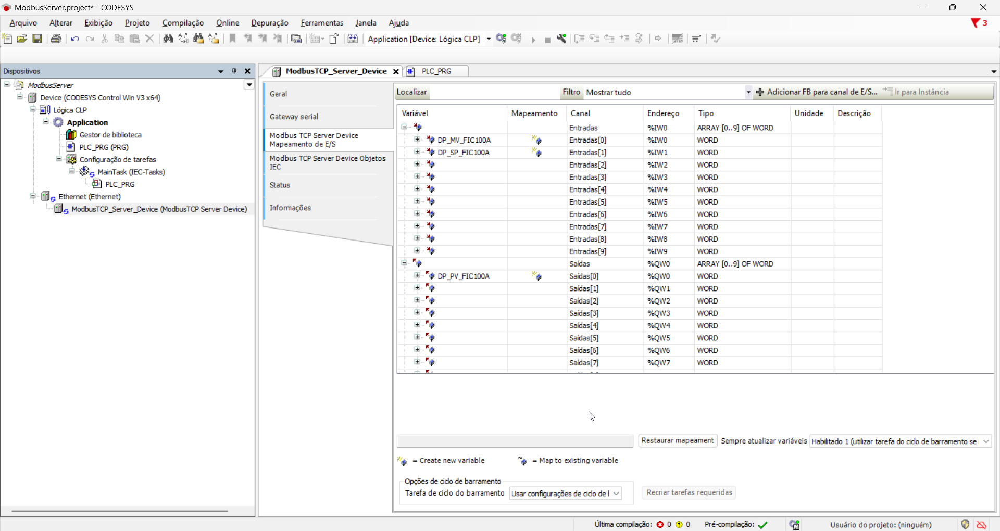

13. **Download** para a CPU: `ALT + F8`. O servidor ficará ativo e pronto para clientes como o SCADA‑LTS.  
    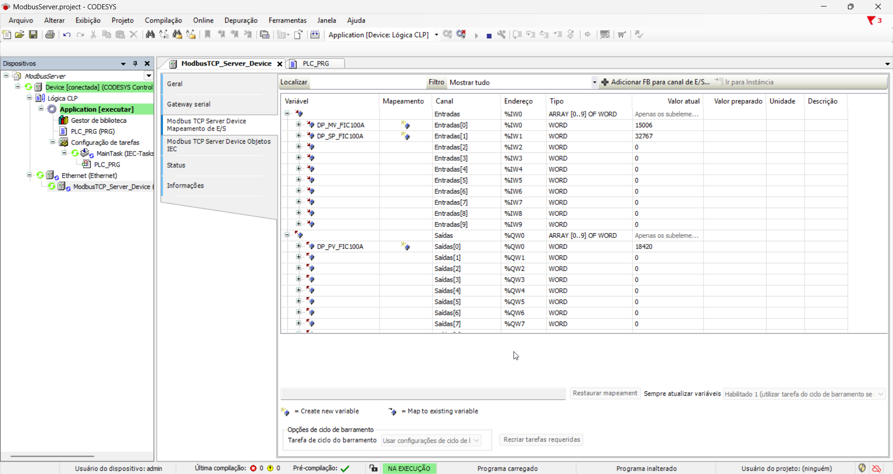  
    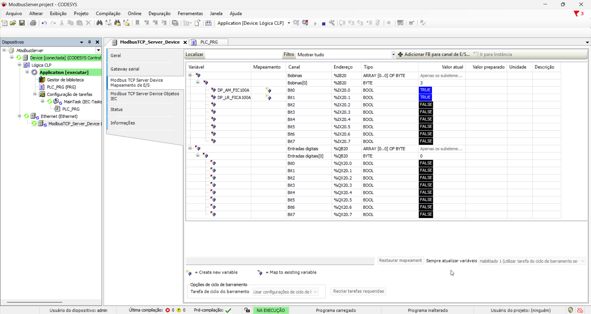

---

## 5. MODBUS Client — SCADA‑LTS

No SCADA‑LTS, configure o **Data Source** do tipo **Modbus IP** (cliente).

1. Acesse **Ferramentas → Data sources**.  
   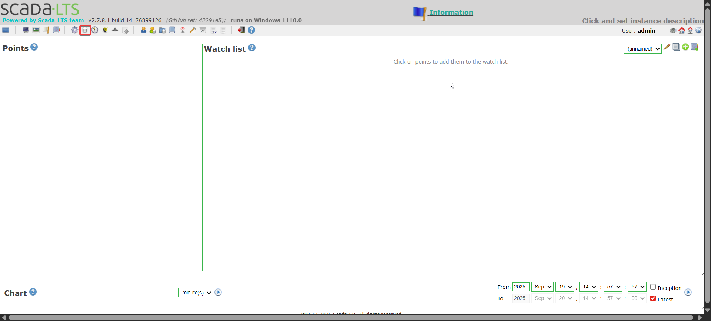

2. Selecione **Modbus IP** → clique em **(+)** para adicionar.  
   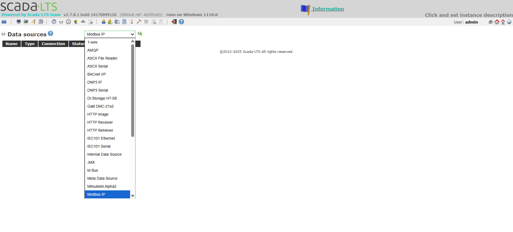

3. Em **Configurações do Data Source**:  
   - **Name**: identificador do seu data source  
   - **Host**: `127.0.0.1` (ou o IP do PC/servidor onde roda o CODESYS)  
   - **Port**: `502`  
   Salve e **Ative**.  
   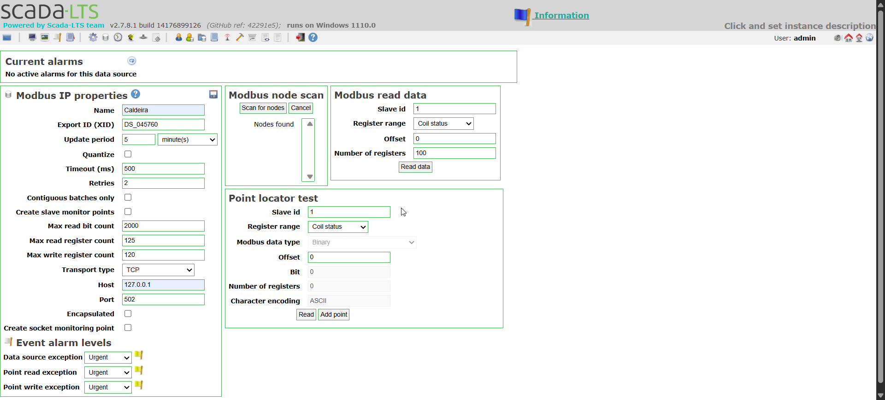

4. Configure os **Data Points**:

   **Holding Registers** (ex.: `DP_MV_FIC100A`, `DP_SP_FIC100A`):  
   - **Add point**  
   - **Name**: igual ao nome da variável do CODESYS  
   - **Slave Id**: `1`  
   - **Faixa do registro**: *Registrador holding*  
   - **Tipo de dados modbus**: *Inteiro 2 bytes sem sinal*  
   - **Offset (base 0)**: `0` (para `DP_MV_FIC100A`), `1` (para `DP_SP_FIC100A`)  
   

   **Input Register** (ex.: `DP_PV_FIC100A`):  
   - **Faixa do registro**: *Registrador de entrada*  
   - **Tipo de dados**: *Inteiro 2 bytes sem sinal*  
   - **Offset (base 0)**: `0`  
   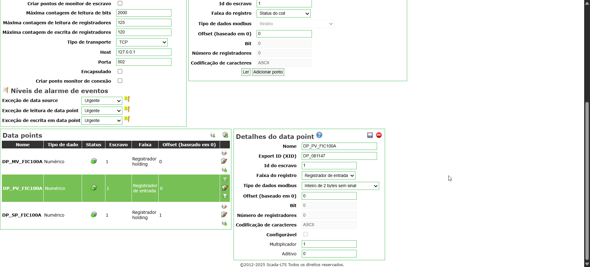

   **Status do Coil** (ex.: `DP_AM_FIC100A`, `DP_LR_FIC100A`):  
   - **Faixa do registro**: *Status do coil*  
   - **Tipo de dados**: *Binário*  
   - **Offset (base 0)**: `0` (AM) e `1` (LR)  
   

---

### ✅ Observações finais
- Se a **porta 8080** estiver em uso, altere para uma porta **livre** durante a instalação do SCADA‑LTS e ajuste o link de acesso.  
- No CODESYS, confirme que o **Gateway** e o **PLC virtual** estão **iniciados** antes do *scan* de rede.  
- Em firewall/antivírus corporativos, libere **porta 502/TCP** (Modbus) e a porta HTTP do SCADA‑LTS.

---